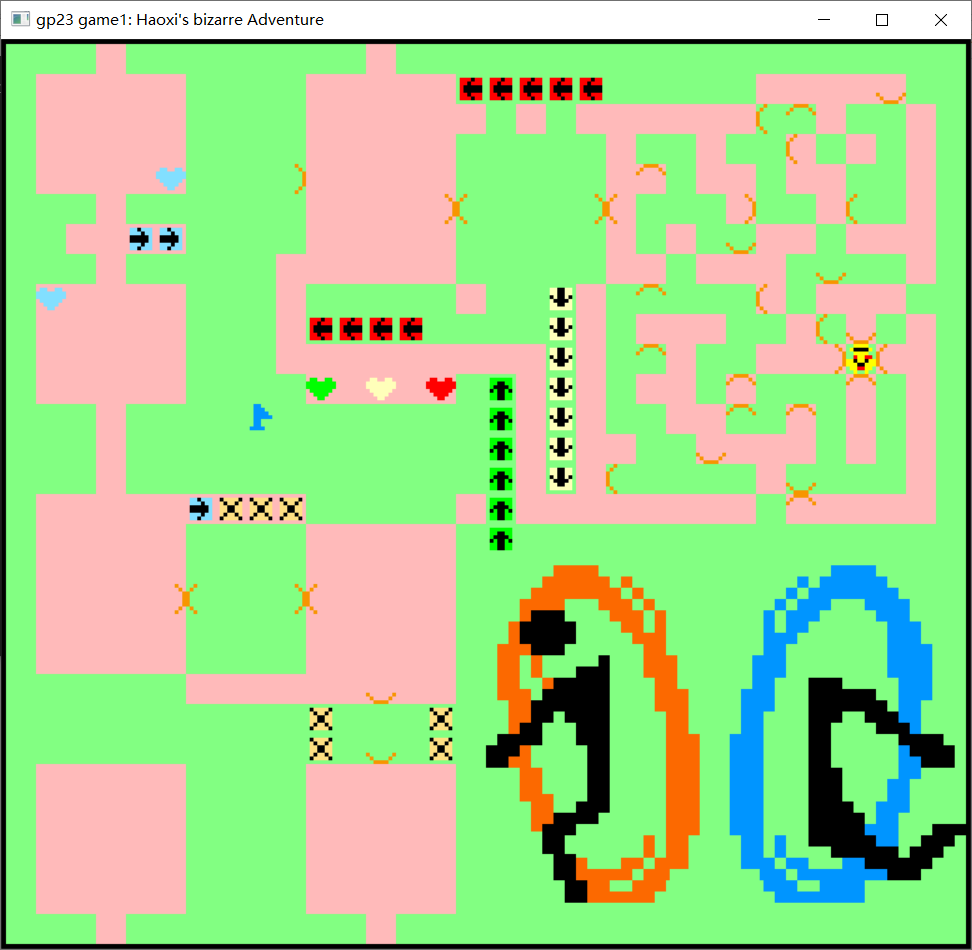

# Haoxi's bizarre Adventure

Author: Haoxi Zhang

Design: A puzzle game with triggers that allow crossing the wall.

IMPORTANT BUG: please do not touch any other key, which may lead to game freeze. Will fix in the future.

### Screen Shot:

### How Your Asset Pipeline Works:

`data.bin` contains everything the game needs. It will read map, door info, trigger info, tile_table, palette_table.

`portal.png` is only 4 colors.  loaded by `load_png()` and be decomposed into tiles.

original picture from [Pinterest](https://www.pinterest.com/pin/minecraft-pixel-art-templates-portal-two--532621093403996865/)

### How To Play:

Use ←↑↓→ to move the yellow character and reach the blue/red flag.

This game was built with [NEST](NEST.md).

